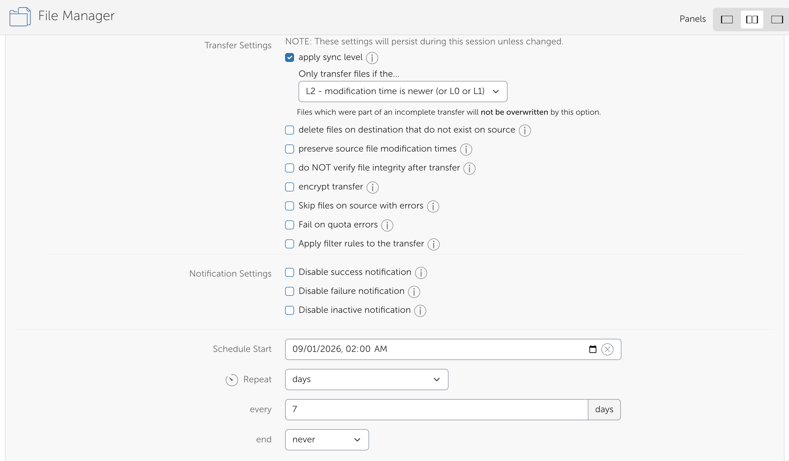
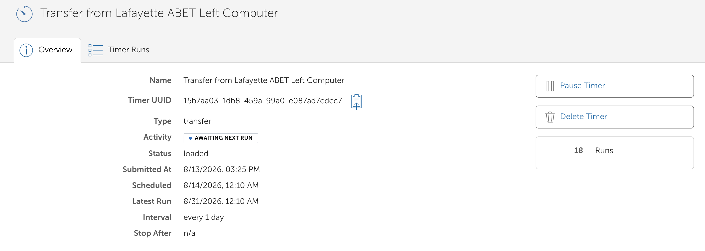

!!! warning "Draft: under review"

    This page is a first draft awaiting review by RCAC's Globus and data transfer owner. Items
    marked **[NEEDS CLARIFICATION]** are unverified and must be confirmed before publication.

If your analysis runs longer than the scratch purge window, everything it has produced so far can
disappear before you are finished. This guide shows you how to set up a Globus **timer**
(a transfer that repeats on a schedule) so a copy of your scratch working directory lands on Data
Depot every week without you remembering to do it.

It assumes you have used Globus at least once by hand. If you have not, start with the Globus
section of the [Data Depot transfer guide](../../userguides/depot/storage/transfer.md), which
covers logging in, finding collections, and the two-pane File Manager.

## Why this matters

Scratch and Data Depot are built for different jobs:

| | Scratch | Data Depot |
|---|---|---|
| Built for | Active computation: high throughput, parallel I/O | Active research data you need to keep |
| Purged? | **Yes.** Files not accessed or modified within the age threshold are removed | No |
| Backup service | **None.** Deleted or purged files are not recoverable | Nightly snapshots on a published retention schedule |
| Redundancy | None | Redundant storage arrays in multiple campus datacenters |

The purge threshold is **60 days on most clusters, 30 days on Anvil and Bell**, measured on each
individual file's last access time *and* content modification time. Renaming a file or changing its
permissions does **not** protect it. A reference genome you staged in month one and have not touched
since is eligible for purge even while the project is still running.

!!! note "Snapshots are not backups"

    Data Depot's snapshots protect against *your* mistakes (an accidental `rm`, a bad script) for
    a limited window. RCAC's guidance is that they are **not** a substitute for backups, and that
    genuinely irreplaceable data belongs in the
    [Fortress archive](../../userguides/depot/recover/index.md). Treat the timer in this guide as
    protection against the purge, not as your only copy of an irreplaceable dataset.

    [NEEDS CLARIFICATION: the brief for this page described Depot as "redundantly backed up across
    two sites". The existing user guide says redundant arrays in multiple campus datacenters, and is
    explicit that snapshots are not backups. Rose, which framing do you want for the DeWoody lab?]

## The working model

The pattern that survives a purge is: **master copy on Depot, compute on scratch, scheduled sync
back to Depot.**

1. **Stage in.** Copy the inputs and reference data you need from Depot to scratch, once, by hand.
2. **Run on scratch.** Point your pipeline's working and output directories at
   `/scratch/<cluster>/<username>/<project>`.
3. **Sync back weekly.** A Globus timer copies scratch back to Depot on a schedule.

Step 2 is worth dwelling on. **Write your pipeline outputs to scratch, not straight to Depot.**
Depot is not built for the many-small-writes, high-concurrency I/O that assemblers, aligners and
Nextflow workers generate; pointing a running pipeline at it will be slow for you and disruptive for
everyone else on the filesystem. Let the pipeline hammer scratch, and let the timer move the results
across in one orderly pass.

The timer is **one-way: scratch → Depot.** It is a backup, not a two-way sync.

!!! danger "Never enable delete-on-destination for a scratch-to-Depot timer"

    Globus offers a sync option variously labelled *"delete files on destination that do not exist
    on source"*. **Do not enable it on any timer whose source is scratch.**

    Scratch gets purged. After a purge your source directory is empty or partly empty, and that is
    exactly what the option tells Globus to reproduce. The next scheduled run will faithfully delete
    your Depot copy to match. The backup you set up to survive the purge is destroyed *by* the
    purge, on a schedule, while every task reports success.

    This is the single most destructive mistake available in this workflow. Leave the option off.

## Creating the timer in the Globus web app

1. Go to <https://transfer.rcac.purdue.edu> and log in with your Purdue Career Account.
2. Open **File Manager** and set up the transfer exactly as you would a one-off:
    - **Left panel (source):** your cluster's scratch collection, path
      `/scratch/<cluster>/<username>/<project>`.
    - **Right panel (destination):** the Data Depot collection, path `/depot/<yourlab>/...`.
    - Select the directory you want backed up.
3. Open **Transfer & Timer Options**. Set:
    - **Sync level**: see [Sync level](#sync-level) below. Choose the modification-time option.
    - **Delete files on destination that do not exist on source**: **leave unchecked.**
    - **Preserve source file modification times**: recommended, so the sync comparison stays
      meaningful across runs.
4. Still in **Transfer & Timer Options**, set **Schedule Start** to when the first run should
   happen, and set a **Repeat interval** of every 7 days.
5. Click **Start**.

Pick a start time when the cluster is quiet and you are not mid-job. A weekend night is a
reasonable default for a weekly backup.



### The CLI equivalent

If you would rather script it, or want the timer recorded in your project notes:

```bash
# One-time login
globus login

# Find the collection UUIDs
globus endpoint search "Data Depot"
globus endpoint search "Cluster Collection"

# Create a weekly recursive backup
globus timer create transfer \
    --name "dewoody-scratch-to-depot-weekly" \
    --interval 7d \
    --recursive \
    --sync-level mtime \
    "$SCRATCH_UUID:/scratch/negishi/myusername/myproject" \
    "$DEPOT_UUID:/depot/mylab/backups/myproject"
```

Note what is **absent**: there is no delete flag. Adding one reintroduces the hazard in the danger
box above.

Check on it later with:

```bash
globus timer list
globus timer show <timer-id>
```

## Sync level

Globus decides per file whether to re-transfer it. The choice that matters here is between
transferring only files that **do not exist** at the destination, and transferring files whose
**modification time** is newer at the source.

**Use the modification-time level** (`--sync-level mtime` on the CLI, `L2 - modification time is newer (or L0 or L1)` option through the webpage). With exists-only, a file that
already exists on Depot is never looked at again, so every result your pipeline *revises* after the
first backup, every log that grows, every table you regenerate, silently stays at its first-week
version on Depot. That failure is invisible until you need the data.

The trade-off is that each run does more comparison work. For a weekly backup of a project
directory, that cost is not worth worrying about.

## Restoring after a purge

Restoring is a **separate, manual transfer**, not a second timer.

Set up a one-off Globus transfer with the panels the other way round: Depot as source, scratch as
destination. Do it deliberately, when you are ready to resume work.

Do **not** be tempted to create a second Depot → scratch timer to keep the two "in sync". Two timers
pointing in opposite directions between the same directories will fight: each run makes the other's
source look stale, and which copy wins depends on run ordering. One timer, one direction.

## Check that it actually worked

**A timer that was accepted is not a transfer that succeeded.** The Timers page tells you the
schedule exists and fired. It does not tell you the data arrived. A run that fails on a quota or a
permission error is a **fatal task error**. The timer stays green and carries on scheduling the
next one.

After the first scheduled run, go to **Activity** and open the **Tasks** tab. You are looking for
the individual task the timer created, and specifically:

- **Status**: `SUCCEEDED`, not `FAILED` and not `SUCCEEDED WITH ERRORS`.
- **Files transferred** and **bytes transferred**: a run that "succeeded" having moved zero bytes
  when you expected gigabytes is telling you something.
- The **error events** on the task, if any.

Check this after the first run, and again after the second. Then check occasionally (monthly is
reasonable) for as long as the project lasts.


Above is an example of an established Globus timer. You can check the overview of the timer in the "Overview" tab and check the timer runs, state, and logs using the "Timer Runs" tab.

!!! tip

    Globus emails you on task failure. Make sure the address on your Globus account is one you
    actually read, and that the mail is not being filtered.

## Size the Depot allocation first

A timer pointed at a full or undersized Depot allocation fails every week, and from your side
nothing looks obviously wrong. The timer is still listed, still scheduled, still firing.

Before you schedule anything, work out roughly what the project will generate and confirm the lab's
Depot space can hold it. Check your current usage with `myquota`, and remember the backup needs
headroom for growth over the months the project runs, not just today's footprint.

If the allocation is too small, see the [Data Depot overview](../../userguides/depot/overview.md)
for how to purchase additional capacity or request a trial space.

## Troubleshooting

### It worked for weeks, then silently stopped

Usually the credential or consent that authorises unattended access has expired. Globus timers run
as you, using a stored consent; when that lapses the timer keeps its schedule but its runs fail
authentication. 

Open the timer in the web app and look for a prompt to re-authenticate or re-grant consent. On the
CLI, `globus session show` and `globus login` will re-establish credentials. 

You can set up proper email notifications in the case of a failed transfer or inactive transfer. Receiving emails for every state (active, inactive, failure) is the default when creating the timer through the webpage. Via the CLI, it looks like this:

```
globus timer create transfer \
  <source-endpoint-id>:<source-path> \
  <dest-endpoint-id>:<dest-path> \
  --interval <interval-time> \
  --notify failed,inactive
```

Globus will email the person who has created the timer.

[NEEDS CLARIFICATION: this is the section that most needs Rose's input. Are the Purdue scratch and
Depot collections GCSv5 with persistent consent? That determines whether a timer survives an
unattended multi-month project at all, or whether the reader should expect to re-authenticate on a
known cadence, which would change the advice above from troubleshooting into a planned step.]

### Quota exhausted

The task fails with a quota or "no space left" error. The timer looks healthy; only the task shows
it. Free space in the Depot allocation or increase it, then re-run the transfer manually to catch
up. The next scheduled run will not backfill on its own if the underlying problem persists.

### Permission denied on Depot

Depot access is controlled by Unix group membership matching your Depot directory structure. A
common cause is that your group's data manager granted access to some root folders but not all of
the ones your transfer touches, so the transfer works for part of the tree and fails elsewhere.

Ask your lab's Depot manager to confirm you have write access to every directory in the destination
path. See [Data Depot permissions](../../userguides/depot/permissions/index.md) for how the groups
map to directories.

## Related

- [Data Depot transfer guide](../../userguides/depot/storage/transfer.md): Globus basics
- [Data Depot overview](../../userguides/depot/overview.md): capacity and purchasing
- [Data Depot permissions](../../userguides/depot/permissions/index.md): Unix groups and access
- [Project organization for bioinformatics on HPC](project-organization.md): where data should live
- [Globus Timers documentation](https://docs.globus.org/api/timers/): upstream reference

[Back to Life Sciences](../index.md){ .md-button }
