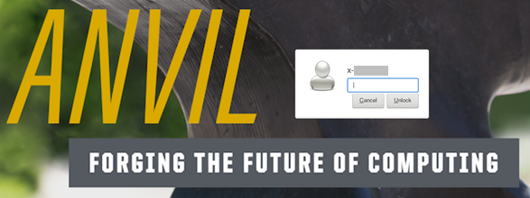
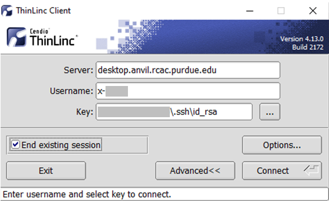
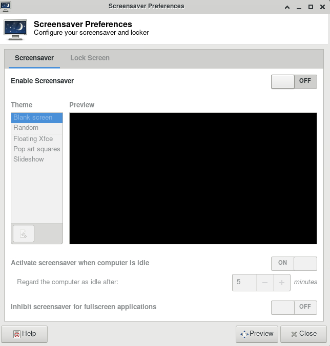

---
tags:
  - Anvil
authors:
  - jin456
cluster: Anvil
---

# Frequently Asked Questions

Some common questions, errors, and problems are categorized below.

## About Anvil

### Can you remove me from the Anvil mailing list?
Your subscription in the Anvil mailing list is tied to your account on Anvil which was granted to you through an ACCESS allocation. If you are no longer using your account on Anvil, you can contact your PI or allocation manager to remove you from their Anvil allocation.

### How is Anvil different than Purdue Community Clusters?
Anvilis part of the national [Advanced Cyberinfrastructure Coordination Ecosystem: Services & Support (ACCESS)](https://access-ci.org/) ecosystem and is not part of Purdue Community Clusters program. There are a lot of similarities between the systems, yet there are also a few differences in hardware, software and overall governance. For Purdue users accustomed to the way Purdue supercomputing clusters operate, the following summarizes key differences between RCAC clusters and Anvil.

**Support**

* While Anvilis operated by Purdue RCAC, it is an ACCESS resource, and all support requests have to go through ACCESS channels rather than RCAC ones. Please direct your Anvilquestions to the [ACCESS Help Desk](https://support.access-ci.org/help-ticket) and they will be dispatched to us.

**Resource Allocations**

Two key things to remember on Anvil and other ACCESS resources:

1. In contrast with Community Clusters, you do not buy nodes on Anvil. To access Anvil, PIs must request an allocation through ACCESS.
2. Users don't get access to a dedicated “owner” queue with X-number of cores. Instead, they get an allocation for Y-number of core-hours. Jobs can be submitted to any of the predefined partitions.

More details on these differences are presented below.

* Access to Anvilis free (no need to purchase nodes), and is governed by [ACCESS allocation policies](https://allocations.access-ci.org/allocations-policy). All allocation requests must be submitted via [ACCESS Resource Allocation System](https://allocations.access-ci.org/prepare-requests). These allocations other than the Maximize ACCESS Request can be requested at any time.

    * [Explore ACCESS allocations](https://allocations.access-ci.org/project-types) are intended for purposes that require small resource amounts. Researchers can try out resources or run benchmarks, instructors can provide access for small-scale classroom activities, research software engineers can develop or port codes, and so on. Graduate students can conduct thesis or dissertation work. To prepare a request, visit [Prepare Requests](https://allocations.access-ci.org/prepare-requests).
    
    * [Discover ACCESS allocations](https://allocations.access-ci.org/project-types) are intended to fill the needs of many small-scale research activities or other resource needs. The goal of this opportunity is to allow many researchers, Campus Champions, and Gateways to request allocations with a minimum amount of effort so they can complete their work. To prepare a request, visit [Prepare Requests](https://allocations.access-ci.org/prepare-requests).
    
    * [Accelerate ACCESS allocations](https://allocations.access-ci.org/project-types) support activities that require more substantial, mid-scale resource amounts to pursue their research objectives. These include activities such as consolidating multi-grant programs, collaborative projects, preparing for Maximize ACCESS requests, and supporting gateways with growing communities. To prepare a request, visit [Prepare Requests](https://allocations.access-ci.org/prepare-requests).
    
    * [Maximize ACCESS allocations](https://allocations.access-ci.org/project-types) are for projects with resource needs beyond those provided by an Accelerate ACCESS project, a Maximize ACCESS request is required. ACCESS does not place an upper limit on the size of allocations that can be requested or awarded at this level, but resource providers may have limits on allocation amounts for specific resources. To prepare a request, visit [Prepare Requests](https://allocations.access-ci.org/prepare-requests).

* Unlike the Community Clusters model (where you “own” a certain amount of nodes and can run on them for the lifetime of the cluster), under ACCESS model, you apply for resource allocations on one or more ACCESS systems, and your project is granted certain amounts of Service Units (SUs) on each system. Different ACCESS centers compute SUs differently, but in general SUs are always some measure of CPU-hours or similar resource usage by your jobs. [Anvil job accounting page](./jobs.md/#job-accounting) provides more details on how we compute SU consumption on Anvil. Once granted, you can use your allocation’s SUs until they are consumed or expired, after which the allocation must be renewed via established ACCESS process (note: no automatic refills, but there are options to extend the time to use up your SUs and request additional SUs as supplements). You can check your allocation balances on ACCESS website, or use a local `mybalance` command in Anvilterminal window.

**Accounts and Passwords**

* Your Anvil account is not the same as your Purdue Career Account. Following ACCESS procedures, you will need to create an ACCESS account (it is these ACCESS user names that your PI or project manager adds to their allocation to grant you access to Anvil). Your Anviluser name will be automatically derived from ACCESS account name, and it will look something similar to `x-ACCESSusername`, starting with an `x-`.
* Anvil does not support password authentication, and there is no “Anvil password”. The recommended authentication method for SSH is public key-based authentication (“SSH keys”). Please see the user guide for [detailed descriptions](./getting-started.md/#ssh) and [steps to configure and use your SSH keys](./getting-started.md/#ssh-keys).

**Storage and Filesystems**

* Anvil scratch purging policies (see the [filesystems section](./file_management.md/#file-systems)) are *significantly* more stringent than on Purdue RCAC systems. Files not accessed for 30 days are deleted instantly and automatically (on the filesystem's internal policy engine level). 

    !!! warning
        There are **NO** warning emails before your files on Anvil scratch get purged. Please backup your important data regularly.

* Purdue Data Depot is not available on Anvil, but every allocation receives a dedicated project space (`$PROJECT`) shared among allocation members in a way very similar to Data Depot. See the [filesystems section](./file_management.md/#file-systems) in the user guide for more details. You can transfer files between Anviland Data Depot or Purdue clusters using any of the mutually supported methods (e.g. SCP, SFTP, rsync, Globus).

* Purdue Fortress is available on Anvil, but direct HSI and HTAR are currently not supported. You can transfer files between Anviland Fortress using any of the mutually supported methods (e.g. SFTP, Globus).

* Anvil features Globus Connect Server v5 which enables direct HTTPS access to data on AnvilGlobus collections right from your browser (both uploads and downloads).

**Partitions and Node Types**

* Anvil consists of several types of compute nodes (regular, large memory, GPU-equipped, etc), arranged into [multiple partitions](./jobs.md/#anvil-queues-partitions) according to various hardware properties and scheduling policies. You are free to direct your jobs and use your SUs in any partition that suits your jobs’ specific computational needs and matches your allocation type (CPU vs. GPU). Note that different partitions may “burn” your SUs at a different rate - see [Anvil job accounting page](./jobs.md/#job-accounting) for detailed description.

    !!! note
        On Anvil, you need to specify *both* allocation account and partition for your jobs (`-A allocation` and `-p partition` options), otherwise your job will end up in the default `shared` partition, which may or may not be optimal. See [partitions page](./jobs.md/#anvil-queues-partitions) for details.

* There are no `standby`, `partner` or `owner`-type queues on Anvil. All jobs in all partitions are prioritized equally.

**Software Stack**

* Two completely separate software stacks and corresponding Lmod module files are provided for CPU- and GPU-based applications. Use `module load modtree/cpu` and `module load modtree/gpu` to switch between them. The CPU stack is loaded by default when you login to the system. See [example jobs section](./jobs.md/#extended-examples) for specific instructions and submission scripts templates.

**Composable Subsystem**

* A [composable subsystem](./composable/index.md) alongside of the main HPC cluster is a uniquely empowering feature of Anvil. Composable subsystem is a Kubernetes-based private cloud that enables researchers to define and stand up custom services, such as notebooks, databases, elastic software stacks, and science gateways.

**Everything Else**

* The above list provides highlights of major differences an RCAC user would find on Anvil, but it is by no means exhaustive. Please refer to [this Anvil User Guide](./index.md) for detailed descriptions, or reach out to us through [ACCESS Help Desk](https://support.access-ci.org/help-ticket)

## Logging In & Accounts

### Can I use browser-based Thinlinc to access Anvil?

Password based access through browser-based Thinlinc to Anvil is not supported at this moment. Please use Thinlinc Client instead.

For your first time login to Anvil, you will have to login to Open OnDemand with your ACCESS username and password to start an anvil terminal and then set up SSH keys. Then you are able to use your native Thinlic client to access Anvil with SSH keys. Follow our [user guide section](getting-started.md) to set this up. 

### What if my ThinLinc screen is locked?

**Problem**

Your ThinLinc desktop is locked after being idle for a while, and it asks for a password to refresh it, but you do not know the password (neither do the Anvil staff).

<figure markdown="span">
    
    <figcaption>In the default settings, the "screensaver" and "lock screen" are turned on, so if your desktop is idle for more than 5 minutes, your screen might be locked.</figcaption>
</figure>

**Solution**

If your screen is locked, close the ThinLinc client, reopen the client login popup, and select `End existing session`.

<figure markdown="span">
    
    <figcaption>Select "End existing session" and try "Connect" again.</figcaption>
</figure>

To permanently avoid screen lock issue, right click desktop and select `Applications`, then `settings`, and select `Screensaver`.

<figure markdown="span">
    
    <figcaption>Select "Applications", then "settings", and select "Screensaver".</figcaption>
</figure>

Under **Screensaver**, turn off the `Enable Screensaver`, then under **Lock Screen**, turn off the `Enable Lock Screen`, and close the window.

<figure markdown="span">
    
    <figcaption>Under "Screensaver" tab, turn off the "Enable Screensaver" option.</figcaption>
</figure>

<figure markdown="span">
    
    <figcaption>Under "Lock Screen" tab, turn off the "Enable Lock Screen" option.</figcaption>
</figure>

## Applications

### Close Firefox / Firefox is already running but not responding

--8<-- "docs/snippets/firefox_lock.md"

### Jupyter:  database is locked / can not load notebook format

--8<-- "docs/snippets/jupyter_lock.md"
