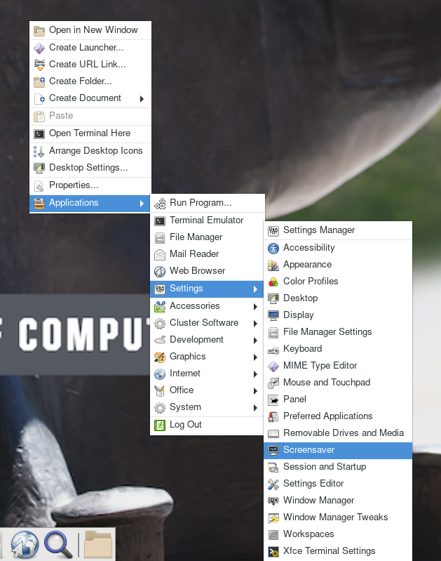
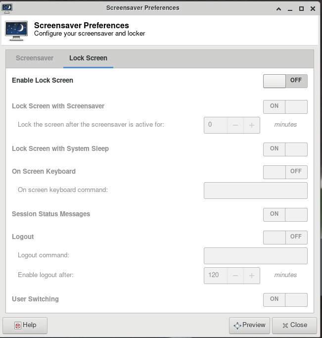

---
tags:
  - Bell
authors:
  - mahlawat
resource: Bell
search:
  boost: 2
---

# How to disable ThinLinc screensaver

### Problem

Your ThinLinc desktop is locked after being idle for a while, and it asks for a password to refresh it. It means the "screensaver" and "lock screen" functions are turned on, but you want to disable these functions.

### Solution

If your screen is locked, close the ThinLinc client, reopen the client login popup, and select `End existing session`.

Select "End existing session" and try "Connect" again.

To permanently avoid screen lock issue, right click desktop and select `Applications`, then `settings`, and select `Screensaver`.

Select "Applications", then "settings", and select "Screensaver".

Under **Screensaver**, turn off the `Enable Screensaver`, then under **Lock Screen**, turn off the `Enable Lock Screen`, and close the window.

Under "Screensaver" tab, turn off the "Enable Screensaver" option.

Under "Lock Screen" tab, turn off the "Enable Lock Screen" option.
