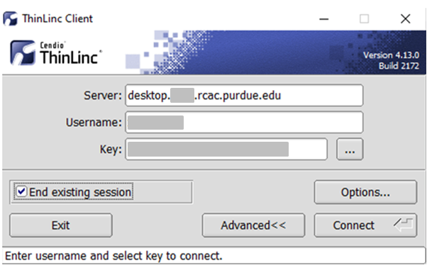

---
tags:
  - Bell
authors:
  - mahlawat
resource: Bell
search:
  boost: 2
---

# ThinLinc session unreachable

### Problem

When trying to login to ThinLinc and re-connect to your existing session, you receive an error *"Your ThinLinc session is currently unreachable"*.

### Solution

This can happen if the specific login node your existing remote desktop session was residing on is currently offline or down, so ThinLinc can not reconnect to your existing session.  Most often the session is non-recoverable at this point, so the solution is to terminate your existing ThinLinc desktop session and start a new one.

* **If you are using a web-version ThinLinc remote desktop (inside the browser):**

  The web version does not have the capability to kill the existing session, only the standalone client does. Please install the standalone client and follow the steps below:

  [ThinLinc](../../../accounts.md#thinlinc)
  
* **If you are using a ThinLinc client:**

  Close the ThinLinc client, reopen the client login popup, and select `End existing session`.

  

  Select "End existing session" and try "Connect" again.
