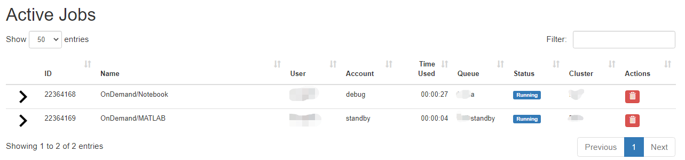
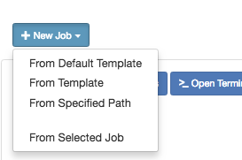
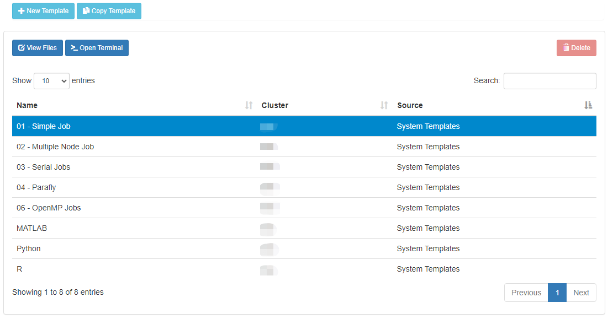
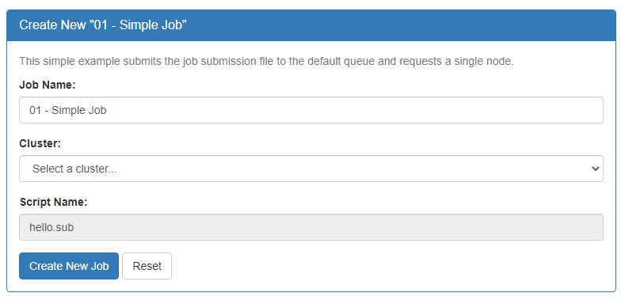
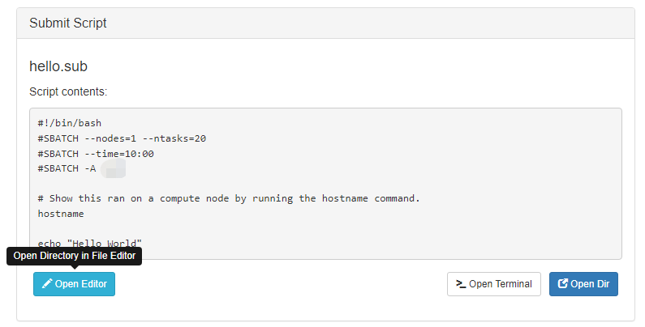
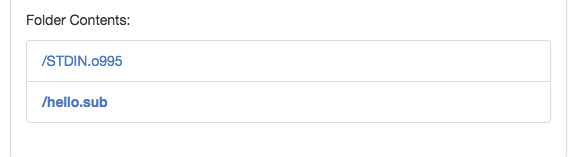
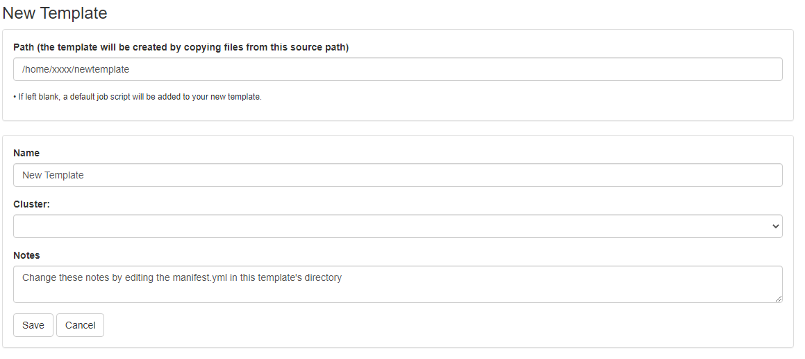

---
tags:
  - Bell
authors:
  - mahlawat
resource: Bell
search:
  boost: 2
---

# Jobs

There are two apps under the Jobs apps: Active Jobs and Job Composer. These are detailed below.

### Active Jobs

This shows you active SLURM jobs currently on the cluster. The default view will show you your current jobs, similar to `squeue -u rices`. Using the button labeled "Your Jobs" in the upper right allows you to select different filters by queue (account). All accounts output by `slist` will appear for you here. Using the arrow on the left hand side will expand the full job details.

The table of active jobs shows useful information such as queue, status, cluster, and ID. It can be sorted by clicking the headers of each column or searched with the "Filter" box above it.

### Job Composer

The Job Composer app allows you to create and submit jobs to the cluster. You can select from pre-defined templates (most of these are taken from the User Guide examples) or you can create your own templates for frequently used workflows.

### Creating Job from Existing Template

Click "New Job" menu, then select "From Template":

When clicking the 'New Job' button a drop-down will show a few options. "From Template" is usually the second item in the list.

Then select from one of the available templates.

Select one of the templates by clicking its row in the table of available templates.

Click 'Create New Job' in second pane.

The "Create New Job" pane will show form options for "Job Name", "Cluster", and "Script Name" with the "Create New Job" button below.

Your new job should be selected in your list of jobs. In the 'Submit Script' pane you can see the job script that was generated with an 'Open Editor' link to open the script in the built-in editor. Open the file in the editor and edit the script as necessary. By default the job will specify standby queue - this should be changed as appropriate, along with the node and walltime requests.

The "Submit Script" pane will show a preview of the contents of the script file and action buttons below.

When you are finished with editing the job and are ready to submit, click the green 'Submit' button at the top of the job list. You can monitor progress from here or from the Active Jobs app. Once completed, you should see the output files appear:

The folder contents will be listed, showing the resulting output files from running the submitted script.

Clicking on one of the output files will open it in the file editor for your viewing.

### Creating New Template

First, prepare a template directory containing a template submission script along with any input files. Then, to import the job into the Job Composer app, click the 'Create New Template' button. Fill in the directory containing your template job script and files in the first box. Give it an appropriate name and notes.

The "Create New Template" form has inputs for "Path", "Name", "Cluster", and "Notes". If "Path" is left blank, a default job script will be added to the new template.

This template will now appear in your list of templates to choose from when composing jobs. You can now go create and submit a job from this new template.
