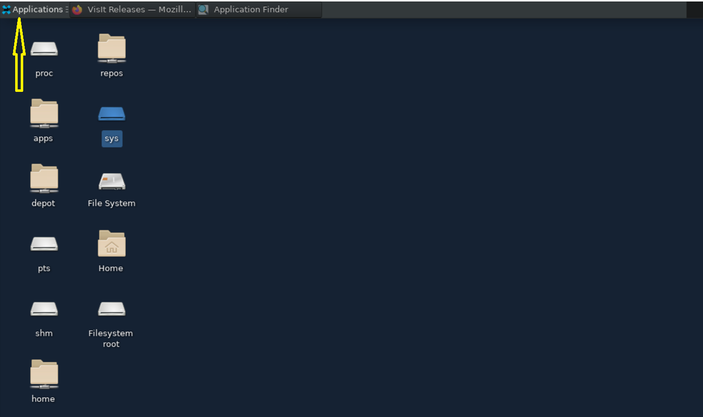
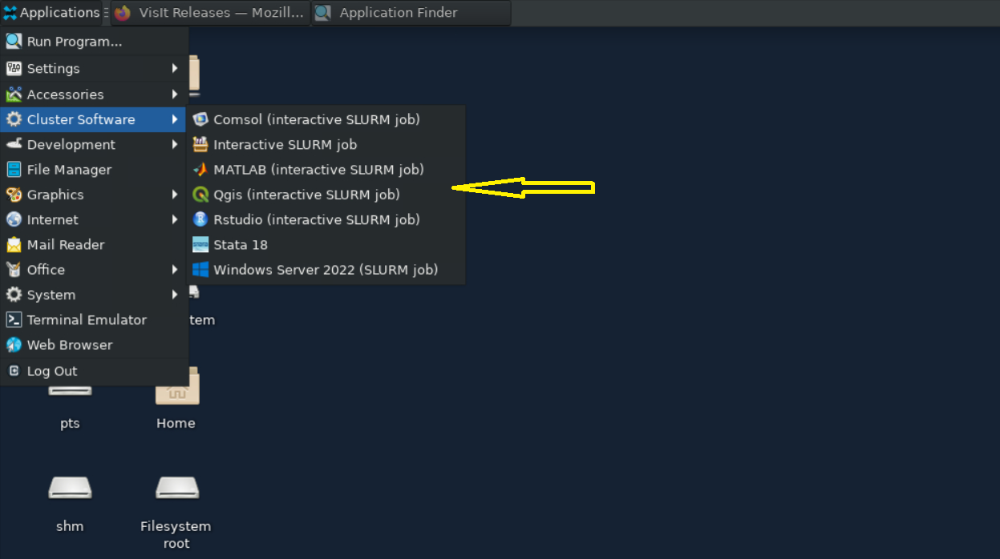
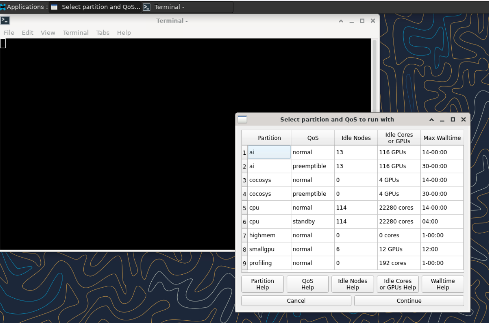
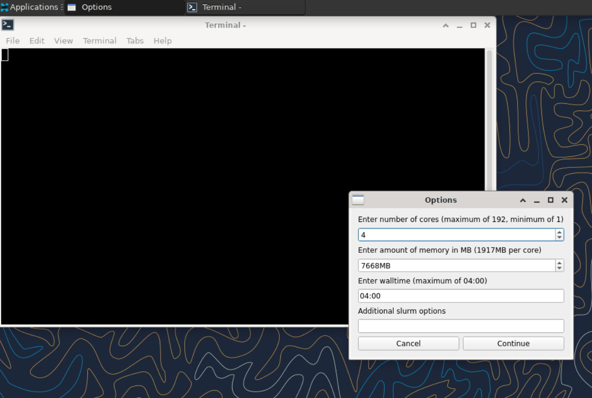
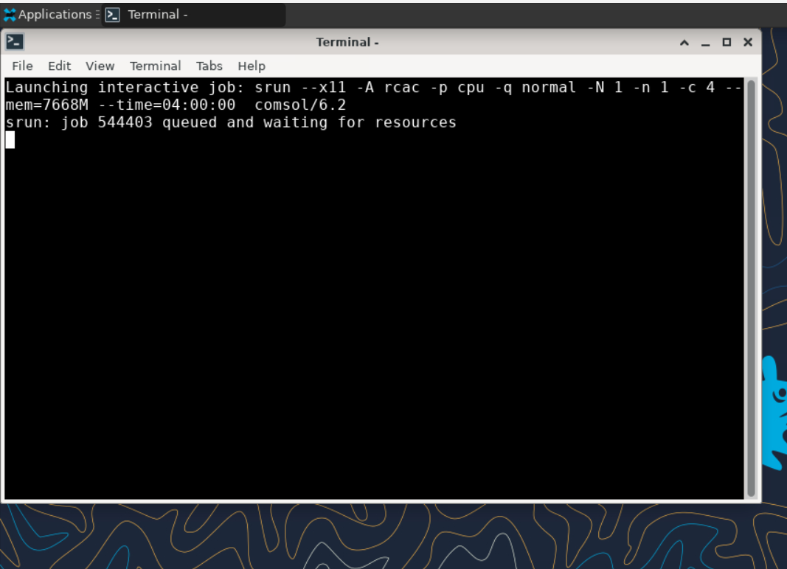

---
tags:
  - Gautschi
authors:
  - jin456
resource: Gautschi
search:
  boost: 2
---

Some common questions, errors, and problems are categorized below. You can also use the search box above to search the user guide for any issues you are seeing. 

## About Gautschi

### Can you remove me from the Gautschi mailing list?
Your subscription in the Gautschi mailing list is tied to your access on Gautschi. The only way to remove you from the Gautschi mailing list is to remove your Gautschi access. If you are no longer using your account on Gautschi, your access can be removed by contacting your group PI or manager. Your Gautschi mailing list subscription will then be removed overnight. Be sure to make a copy of any data you wish to keep first.

### How is Gautschi different than other Community Clusters?
Gautschi differs from the previous Community Clusters in many significant aspects:

- Gautschi has a unique sales protocol. While previous clusters were available for sale based on compute resources, Gautschi is sold based on compute resource hours.
- Gautschi has eight **NVIDIA H100 GPUs**, each with 80 GB of GPU memory.

Learn more from [Gautschi overview](./overview.md).

### Do I need to do anything to my firewall to access Gautschi?
No firewall changes are needed to access Gautschi. However, to access data through Network Drives (i.e., CIFS, "Z: Drive"), you must be on a Purdue campus network or connected through [VPN](https://it.purdue.edu/services/vpn.php).

### Does Gautschi have the same home directory as other clusters?
The Gautschi `home` directory and its contents are exclusive to Gautschi cluster front-end hosts and compute nodes. This `home` directory is not available on other RCAC machines but Gautschi. There is no automatic copying or synchronization between `home` directories.

At your discretion you can manually copy all or parts of your main research computing home to Gautschi using one of the [suggested transfer methods in this section](./storage.md).

## Applications

### How should I launch common GUI applications on Gautschi?
Users who have access to **Gautschi** can use **ThinLinc** to launch an interactive jobs. Refer to [this user guide section](./accounts.md/#thinlinc) to learn how to setup Thinlinc for Gautschi.

* In the upper left corner, the user can click on **Applications**, then **Cluster Software**, where multiple software options are listed with interactive SLURM jobs.

    <figure style="text-align: center;">
        
        <figcaption>Thinlinc application menu</figcaption>
    </figure>

* The **GUI launcher** starts with a window that prompts the user to select the desired version of the software to launch and guides them through the job submission process.

    <figure style="text-align: center;">
        
        <figcaption>Thinlinc application selector</figcaption>
    </figure>

* The **GUI launcher** also makes it easy for users to view available accounts, the maximum wall times for each account, and the available computing resources with multiple help options at the bottom.

    <figure style="text-align: center;">
        
        <figcaption>Partition selection</figcaption>
    </figure>

* After choosing the partition, the user is prompted to provide the computing resource they need for their job to run while adjusting the memory for them automatically.

    <figure style="text-align: center;">
        
        <figcaption>Resource options for your job</figcaption>
    </figure>

* After requesting the resources the job will be submitted and waiting for slurm to allocate the computing resources.

    <figure style="text-align: center;">
        
        <figcaption>Interactive job has been submitted</figcaption>
    </figure>

### Close Firefox / Firefox is already running but not responding

--8<-- "docs/snippets/firefox_lock.md"

### Jupyter:  database is locked / can not load notebook format

--8<-- "docs/snippets/jupyter_lock.md"