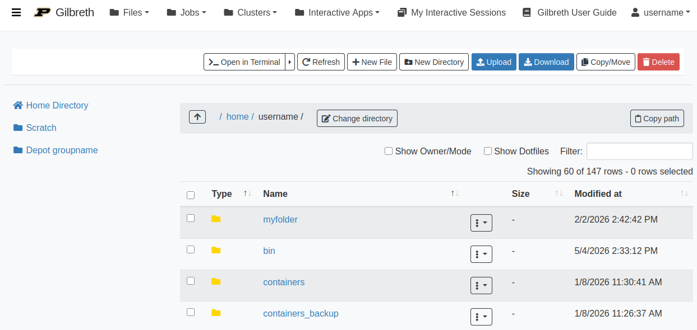

---
tags:
  - Gilbreth
authors:
  - jin456
  - verburgt
resource: Gilbreth
search:
  boost: 2
---

# Files

The Files app will let you access your files in your [Home Directory](../storage/home_directory.md), [Scratch](../storage/scratch_space.md), and [Data Depot](../storage.md) spaces. The app lets you manage create, manage, and delete files and directories from your web browser. Navigate by double clicking on folders in the file explorer or by using the file tree on the left.

The browser-based file explorer. Navigate by double clicking on folders in the file explorer or by using the file tree on the left.

On the top row, there are buttons to:

* Go To: directly input a directory to navigate to
* Open in Terminal: launches the Shell app and navigates you to the current directory in the terminal
* New File: creates a new, empty file
* New Directory: creates a new, empty directory
* Upload: upload a file from your computer
* Download: download a file to your computer
* Copy/Move: Copy or move files around the Gilbreth filesystem

!!! note
    File uploads from your browser are limited to 100 GB per file. Be mindful that uploads over a few gigabytes may be unreliable through your browser, especially from off-campus connections. For very large files or off-campus transfers alternative methods such as [Globus](../storage/globus.md) are highly recommended.

[Back to Gateway](../gateway.md)