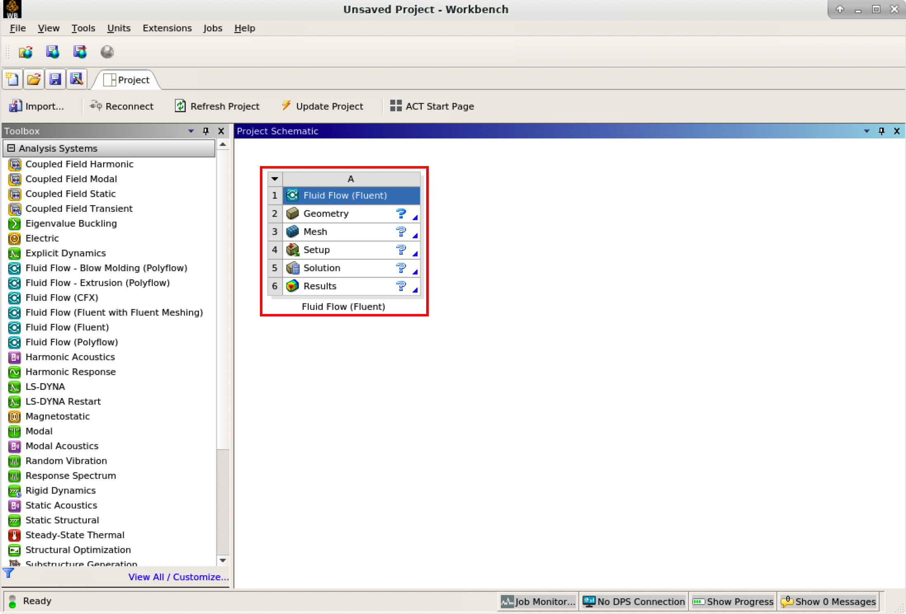
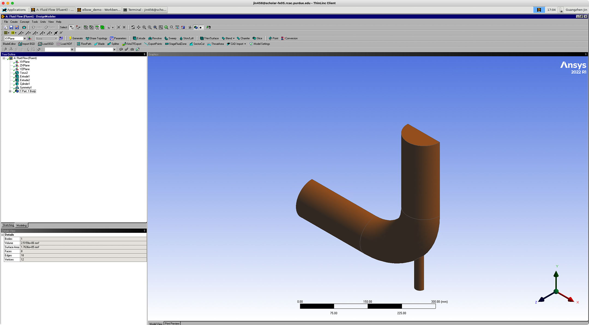
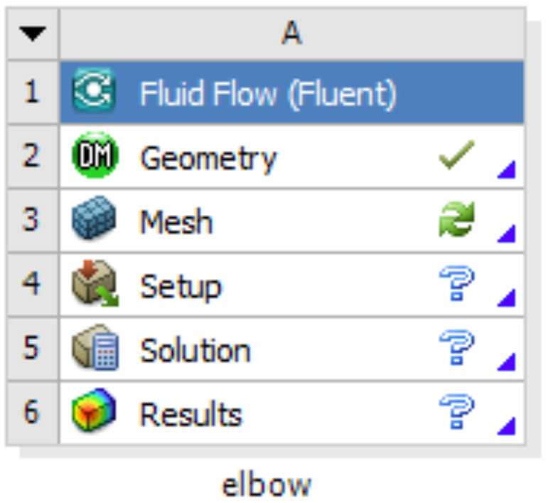

---
tags:
  - Gilbreth
authors:
  - jin456
  - verburgt
resource: Gilbreth
search:
  boost: 2
---

# Preparing Case Files for Fluent

### Creating a Fluent fluid analysis system

In the Ansys Workbench, create a new fluid flow analysis by double-clicking the Fluid Flow (Fluent) option under the Analysis Systems in the Toolbox on the left panel. You can also drag-and-drop the analysis system into the Project Schematic. A green dotted outline indicating a potential location for the new system initially appears in the Project Schematic. When you drag the system to one of the outlines, it turns into a red box to indicate the chosen location of the new system.



Ansys Workbench GUI and the Fluid Flow system for Fluent.

The red rectangle indicates the Fluid Flow system for Fluent, which includes all the essential workflows from “2 Geometry” to “6 Results”. You can rename it and carry out the necessary step-by-step procedures by double-clicking the corresponding cells.

It is important to save the project. Ansys Workbench saves the project with a `.wbpj` extension and also all the supporting files into a folder with the same name. In this case, a file named `elbow_demo.wbpj` and a folder `$Ansys_PROJECT_FOLDER/elbow_demo_files/` are created in the Ansys project folder:

```bash
$ ll
total 33
drwxr-xr-x 7  ${user.username} itap     9 Mar  3 17:47 elbow_demo_files
-rw-r--r-- 1  ${user.username} itap 42597 Mar  3 17:47 elbow_demo.wbpj
```

You should always “Update Project” and save it after finishing a procedure.

### Creating Geometry in the Ansys DesignModeler

Create a geometry in the Ansys DesignModeler (by double-clicking “Geometry” cell in workflow), or import the appropriate geometry file (by right-clicking the Geometry cell and selecting “Import Geometry” option from the context menu).

You can use Ansys DesignModeler to create 2D/3D geometries or even draw the objects yourself. In our example, we created only half of the elbow pipe because the symmetry of the structure is taken into account to reduce the computation intensity.



Elbow pipe created in Ansys DesignModeler.

After saving the geometry, a geometry file `FFF.agdb` will be created in the folder: `$Ansys_PROJECT_FOLDER/elbow_demo_file/dp0/FFF/DM/`. The project in Workbench will be updated automatically.

If you import a pre-existing geometry into Ansys DesignModeler, it will also generate this file with the same filename at this location.

### Creating mesh in the Ansys Meshing

Now that we have created the elbow pipe geometry, a computational mesh can be generated by the Meshing application throughout the flow volume.

With the successful creation of the geometry, there should be a green check showing the completion of “Geometry” in the Ansys Workbench. A Refresh Required icon within the “Mesh” cell indicates the mesh needs to be updated and refreshed for the system.



Status for different cells shown in Ansys Workbench.

Then it’s time to open the Ansys Meshing application by double-clicking the “Mesh” cell and editing the mesh for the project. Generally, there are several steps we need to take to define the mesh:

1. Create names for all geometry boundaries such as the inlets, outlets and fluid body. Note: You can use the strings “velocity inlet” and “pressure outlet” in the named selections (with or without hyphens or underscore characters) to allow Ansys Fluent to automatically detect and assign the corresponding boundary types accordingly. Use “Fluid” for the body to let Ansys Fluent automatically detect that the volume is a fluid zone and treat it accordingly.
2. Set basic meshing parameters for the Ansys Meshing application. Here are several important parameters you may need to assign: Sizing, Quality, Body Sizing Control, Inflation.
3. Select “Generate” to generate the mesh and “Update” to update the mesh into the system. Note: Once the mesh is generated, you can view the mesh statistics by opening the Statistics node in the Details of “Mesh” view. This will display information such as the number of nodes and the number of elements, which gives you a general idea for the future computational resources and time.

After generation and updating the mesh, a mesh file `FFF.msh` will be generated in folder `$Ansys_PROJECT_FOLDER/elbow_demo_file/dp0/FFF/MECH/` and a mesh database file `FFF.mshdb` will be generated in folder `$Ansys_PROJECT_FOLDER/elbow_demo_file/dp0/global/MECH/`.

Parameters used in demo case (use default if not assigned):

1. Length Unit=”mm”
2. Names defined for geometry:
   * velocity-inlet-large (large inlet on pipe);
   * velocity-inlet-small (small inlet on pipe);
   * pressure-outlet (outlet on pipe);
   * symmetry (symmetry surface);
   * Fluid (body);
3. Mesh:
   * Quality: Smoothing=”high”;
   * Inflation: Use Automatic Inflation=“Program Controlled”, Inflation Option=”Smooth Transition”;
4. Statistics:
   * Nodes=29371;
   * Elements=87647.

### Calculation with Fluent

Now all the preparations have been ready for the numerical calculation in Ansys Fluent. Both “Geometry” and “Mesh” cells should have green checks on. We can set up the CFD simulation parameters in Ansys Fluent by double-clicking the “Setup” cell.

When Ansys Fluent is first started or by selecting “editing” on the “Setup” cell, the Fluent Launcher is displayed, enabling you to view and/or set certain Ansys Fluent start-up options (e.g. Precision, Parallel, Display). Note that “Dimension” is fixed to “3D” because we are using a 3D model in this project.

After the Fluent is opened, an Ansys Fluent settings file `FFF.set` is written under the folder `$Ansys_PROJECT_FOLDER/elbow_demo_file/dp0/FFF/Fluent/`.

Then we are going to set up all the necessary parameters for Fluent computation. Here are the key steps for the setup:

1. Setting up the domain:
   * Change the units for length to be consistent with the Mesh;
   * Check the mesh statistics and quality;
2. Setting up physics:
   * Solver: “Energy”, “Viscous Model”, “Near-Wall Treatment”;
   * Materials;
   * Zones;
   * Boundaries: Inlet, Outlet, Internal, Symmetry, Wall;
3. Solving:
   * Solution Methods;
   * Reports;
   * Initialization;
   * Iterations and output frequency.

Then the calculation will be carried out and the results will be written out into `FFF-1.cas.gz` under folder `$Ansys_PROJECT_FOLDER/elbow_demo_file/dp0/FFF/Fluent/`.

This file contains all the settings and simulation results which can be loaded for post analysis and re-computation (more details will be introduced in the following sections). If only configurations and settings within the Fluent are needed, we can open independent Fluent or submit Fluent jobs with bash commands by loading the existing case in order to facilitate the computation process.

Parameters used in demo case (use default if not assigned):

1. Domain Setup: Length Units=”mm”;
2. Solver: Energy=”on”; Viscous Model=”k-epsilon”; Near-Wall Treatment=”Enhanced Wall Treatment”;
3. Materials: water (Density=1000[kg/m^3]; Specific Heat=4216[J/kg-k]; Thermal Conductivity=0.677[w/m-k]; Viscosity=8e-4[kg/m-s]);
4. Zones=”fluid (water)”;
5. Inlet=”velocity-inlet-large” (Velocity Magnitude=0.4m/s, Specification Method=”Intensity and Hydraulic Diameter”, Turbulent Intensity=5%; Hydraulic Diameter=100mm; Thermal Temperature=293.15k) &”velocity-inlet-small” (Velocity Magnitude=1.2m/s, Specification Method=”Intensity and Hydraulic Diameter”, Turbulent Intensity=5%; Hydraulic Diameter=25mm; Thermal Temperature=313.15k); Internal=”interior-fluid”; Symmetry=”symmetry”; Wall=”wall-fluid”;
6. Solution Methods: Gradient=”Green-Gauss Node Based”;
7. Report: plot residual and “Facet Maximum” for “pressure-outlet”
8. Hybrid Initialization;
9. 300 iterations.

[**Back to Ansys Fluent**](../ansysfluent_example.md)