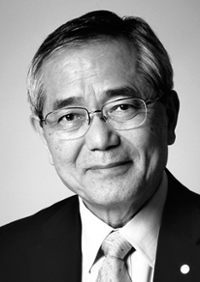

---
tags:
  - Negishi
authors:
  - hkashgar
search:
  boost: 2
---

# Biography of Ei-ichi Negishi

{ align=right }

Ei-ichi Negishi (1935-2021) was the Herbert C. Brown Distinguished Professor in the Department of Chemistry at Purdue. He came to Purdue in 1966 as a postdoctoral researcher in the lab of the Late Herbert C. Brown, and published 33 papers with Prof. Brown up through the time that Prof. Brown was awarded the Nobel Prize in Chemistry in 1979. With the award of the Nobel to Ei-ichi Negishi in 2010, Purdue has the rare distinction of a pair of Nobel Prize awards in two closely related areas. Professor Negishi’s Nobel Prize was awarded in recognition of his work on palladium-catalyzed cross-coupling chemistry (known world-– wide as the Negishi coupling). That work was described by the Nobel Foundation as "great art in a test tube". This is certainly appropriate as great scientists regard themselves as artists and explorers. The impact of that work was widespread, as it had been used in synthetic organic chemistry research worldwide, as well as in the commercial production of an array of pharmaceuticals and molecules used in the electronics industry. In recognition of and consistent with this idea, Ei-ichi and co-recipient Akira Suzuki were recently awarded Japan's highest cultural award, the "Order of Culture", bestowed in Nov. 2010 by the Emperor.

Professor Negishi was a prolific researcher, with ~400 publications on an array of problems in synthetic organic chemistry, leading to numerous awards. To name just a few, the list includes the Chemical Society of Japan Award (1997), the American Chemical Society Award in Organometallic Chemistry (1998), the McCoy Award (1998), the Sigma Xi Award at Purdue (2003), the Nobel Prize in Chemistry (2010), the Order of Culture in Japan (2010), the American Chemical Society Award for Creative Work in Synthetic Organic Chemistry (2010), the Indiana Sagamore of the Wabash (2011) and the Purdue Order of the Griffin (2011). He was elected to the American Academy of Arts and Sciences in 2011. Professor Negishi was leading the Negishi-Brown Institute, which had continued his work on catalytic organic synthesis. Dr. Negishi was passionate about the prospects for catalytic approaches to the reduction of carbon dioxide to enable large scale production of useful products from this environmental waste product. It is very fitting that Purdue bestow an honorary doctorate degree on Professor Negishi, whose accomplishments and contributions will have a permanent impact on Purdue’s stature and global recognition.

[**Back to Negishi User Guide**](index.md)
