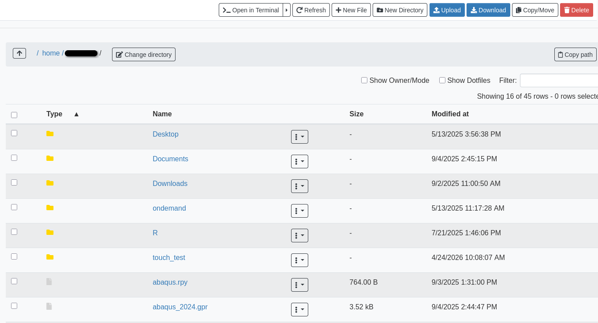
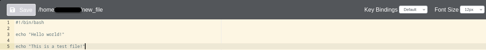

---
tags:
  - Scholar
authors:
  - jin456
resource: scholar
host: scholar.rcac.purdue.edu
search:
  boost: 2
---

# Files

The Files app will let you access your files in your [Home Directory](../storage/home_directory.md), [Scratch](../storage/scratch_space.md), and [Data Depot](https://www.rcac.purdue.edu/storage/depot) spaces. The app lets you manage create, manage, and delete files and directories from your web browser. Navigate by double clicking on folders in the file explorer or by using the file tree on the left.

<figcaption>The browser-based file explorer. Navigate by double clicking on folders in the file explorer or by using the file tree on the left.</figcaption>

On the top row, there are buttons to:

- Go To: directly input a directory to navigate to
- Open in Terminal: launches the Shell app and navigates you to the current directory in the terminal
- New File: creates a new, empty file
- New Dir: creates a new, empty directory
- Upload: upload a file from your computer

Note: File uploads from your browser are limited to 100 GB per file. Be mindful that uploads over a few gigabytes may be unreliable through your browser, especially from off-campus connections. For very large files or off-campus transfers alternative methods such as [Globus](../storage/globus.md) are highly recommended.

The second row of buttons lets you perform typical file management operations. The Edit button will open files in a fully fledged browser based text editor - it features syntax highlighting and vim and Emacs key bindings.

<figcaption>The browser-based text editor interface, shown here editing a Bash script, includes syntax highlighting, font-size adjustments, and various key bindings.</figcaption>

[**Return to the Gateway / OnDemand section**](../gateway.md)
