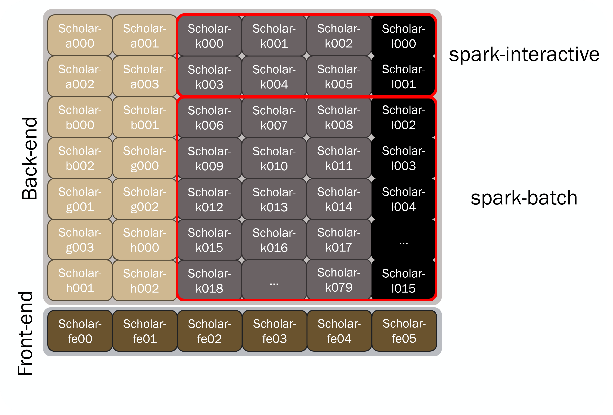
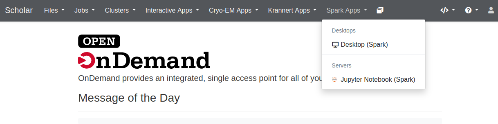
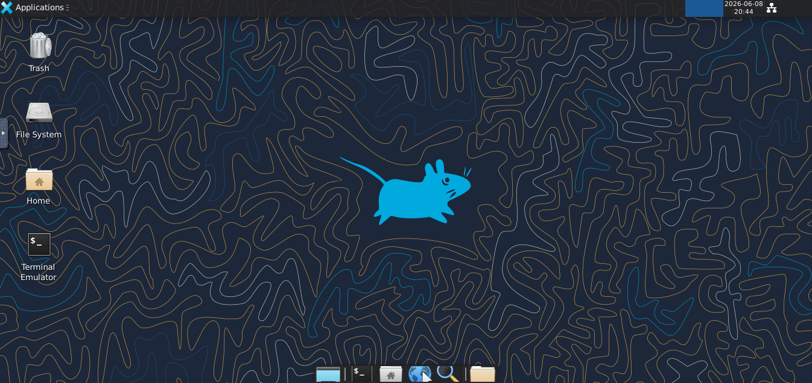
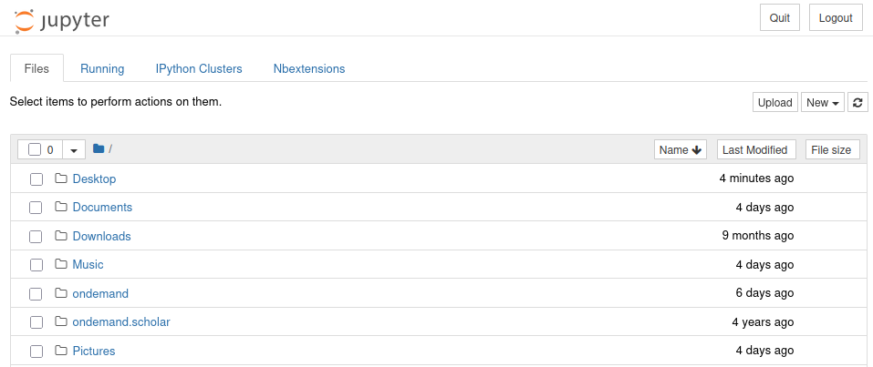
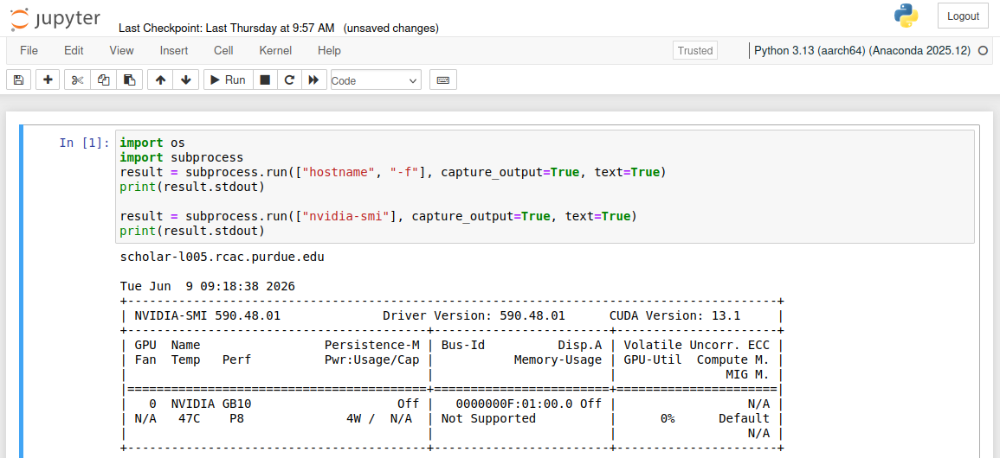
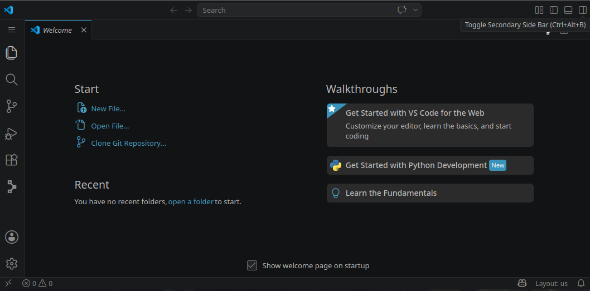

---
tags:
  - Scholar
authors:
  - verburgt
date:
  created: 2026-06-11
  updated: 2026-06-11
resource: Scholar
host: scholar.rcac.purdue.edu
search:
  boost: 2
  exclude: false
---

# Scholar Spark Nodes

<!-- !!! info "You are viewing an unlisted demo page for early users of the Spark partitions"
     This page is unlisted and contains information that might not represent the current state of Scholar Spark nodes.  -->


## Overview

Scholar Spark nodes exist as a unique subset of our Scholar instructional cluster. They can be accessed as a typical cluster, with a job scheduler distributing batch jobs onto its worker nodes, or as an interactive resource, with software packages available through a desktop-like environment on the spark-interactive nodes.

### Specifications

The `scholar-l` and `scholar-k` subclusters provide access to NVIDIA GB10 Grace Blackwell systems. The `scholar-l` subcluster contains Dell Pro Max with GB10 nodes, while the `scholar-k` subcluster contains NVIDIA GB10/DGX Spark nodes. Each node includes a 20-core Arm Grace CPU, 128 GB of LPDDR5X coherent unified CPU/GPU memory, and one NVIDIA GB10 Blackwell GPU.

All Spark nodes run the Ubuntu 24.04 LTS operating system.

| subcluster | System | Number of Nodes | Processors per Node   | Cores per Node | Memory per Node                                      | GPUs per Node                |
| --------- | ---------------------------- | --------------: | ------------- | -------------: | ---------- | ---------------------------- |
| scholar-l | Dell Pro Max with GB10        |              16 | NVIDIA GB10 Grace CPU, 10 Cortex-X925 + 10 Cortex-A725 cores |             20 | 128 GB LPDDR5X coherent unified CPU/GPU memory       | 1 NVIDIA GB10 Blackwell GPU  |
| scholar-k | NVIDIA DGX Spark / GB10 nodes |              80 | NVIDIA GB10 Grace CPU, 10 Cortex-X925 + 10 Cortex-A725 cores |             20 | 128 GB LPDDR5X coherent unified CPU/GPU memory       | 1 NVIDIA GB10 Blackwell GPU  |

 *\*Memory is unified LPDDR5X shared by CPU and GPU, not separate system RAM plus GPU VRAM.*

!!! warning "**Important:** Scholar-Spark Nodes have `aarch64` architecture"
    Programs built for `x86_64` architecture will **NOT** be able to run on Scholar-Spark. See the [Software & Applications](./scholar-spark.md#software-and-applications) section below for more details.

## Layout

The Spark nodes are a subset of the broader Scholar instructional cluster. Because of this, there are not dedicated front-end nodes. Instead, users can perform work interactively on a "spark interactive" node. Further, being a subset of Scholar, the Spark nodes share the same Slurm scheduler and filesystems (`/home`, `/scratch`, `/depot`, `/class`, and `/apps`) as the broader Scholar cluster. See the [Storage Systems](./storage.md) user guide page for more details!

### Partitions
The Spark nodes are are split into two partitions:

* **Spark Interactive**
    * Spark Interactive nodes are "oversubscribed" and are available for immediate access by students and researchers through the Slurm scheduler.
    * These are a shared environment that is useful for interactive work and staging heavier computational work.
* **Spark Batch**
    * These nodes function like traditional back-end compute nodes, and allow you to request resources exclusive to you through the Slurm scheduler.
    * If the resources you requested are not available, your job will be queued and will run when resources become available.

<!-- !!! question 
    **TODO** Are we calling this "spark batch" or "spark compute" Slack channel and outline word doc differ -->




## Accessing Spark Nodes

### Interactive Open OnDemand Applications

To run Open OnDemand applications on a Spark node, you will first need to log into [gateway.scholar.rcac.purdue.edu](https://gateway.scholar.rcac.purdue.edu). On the top ribbon, you will see an "Spark Apps" dropdown menu that contains all interactive applications designed for use on Scholar Spark nodes. 



Selecting any of these will bring you to a submission page to specify the account, partition, and resources to request. Details on the available interactive applications are given below:

=== "Desktop (Spark)"

    The Desktop (Spark) option provides a virtual desktop on a Spark node, running completely in your browser. This can be useful for running graphical applications, or for users with limited command line experience.

    

=== "Jupyter Notebook (Spark)"

    The Jupyter Notebook (Spark) will launch a Jupyter server on a Spark node, which will be displayed in your browser. 

    

    The default kernels (Python, R, Julia) available on Jupyter Spark are all `aarch64` compatible. Users are also able to install their own kernels from conda environments via: 
    ```bash linenums="0"
    python -m ipykernel install --user --name envname --display-name "Python (envname)"
    ``` 
    
    or by building the conda environment via the `conda-env-mod` command. As with all applications on Spark nodes, please ensure that they are `aarch64` compatible.

    
    
=== "VS Code (Spark)"

    The VS Code (Spark) will launch a Visual Studio Code server on a spark node, which will be displayed in your browser. 

    

    This can be useful for on-cluster development and code management.

---

### Accessing Through Scholar Frontend

As Scholar Spark nodes exist within the broader Scholar cluster, you must first login to the Scholar front-end to access the Spark nodes. Once you are logged into Scholar, you can navigate onto the Spark nodes. An overview of the methods for accessing Scholar are given below, but complete details can be found in the Scholar [Accounts](./accounts.md#logging-in) userguide page.

<!-- !!! question
    **TODO** Are we supporting direct ssh to interactive nodes? -->

Once logged in, you can submit resource requests to the Slurm scheduler to request resources on the Spark nodes. These can either be [batch jobs](./run_jobs/generic_slurm_jobs.md) or [interactive jobs](./run_jobs/interactive_jobs.md).

To request resources on Spark nodes specifically, you need use a Spark specific **Account** and **Partition**:


<!-- !!! info "Different Accounts and Partitions Necessary for Early Users"
     Early users of Spark nodes should instead use the following accounts and partitions:

     * `--account=scholar`
     * `--partition=spark-interactive` or `--partition=spark-batch` -->

=== "Account"

    <!-- !!! question
        **TODO** Just checking that we're only having a single account for all spark usage (Powerpoint shows this) for all spark access types (Non-ECE, ECE-WL, ECE-Indy) -->

    To access Spark nodes, you must submit jobs through the `scholar` account. 

    This can be specified via the command line options:
    
    ``` linenums="0"
    --account=scholar
    ``` 

    or 
    
    ``` linenums="0"
    -A scholar
    ``` 


=== "Partition"

    Accessing Spark nodes also requires that you submit jobs through one of the two Spark partitions:

    * `spark-interactive`
        * Spark Interactive nodes are "oversubscribed" and are available for immediate access by students and researchers through the Slurm scheduler.
        * These are a shared environment that is useful for interactive work and staging heavier computational work.
    * `spark-batch`
        * These nodes function like traditional back-end compute nodes, and allow you to request resources exclusive to you through the Slurm scheduler.
        * If the resources you requested are not available, your job will be queued and will run when resources become available.


    These can also be specified via command line options:

    ``` linenums="0"
    --partition=spark-interactive
    ```
    
    or 
    
    ``` linenums="0"
    -P spark-batch
    ```

<!-- !!! question
    **TODO** How are GPU gres going to be managed when submitting to oversubscribed spark-interactive nodes? Can they all be allocated the same GPU? -->

--- 

#### Batch Job Example

The following script requests a batch job with 10 cores and 1 gpu for a 1 hour duration


```bash title="example_spark_job.sub" linenums="0"
#!/bin/bash
#SBATCH  --account=scholar
#SBATCH  --partition=spark-batch
#SBATCH  --time=0-1:00:00
#SBATCH  --nodes=1
#SBATCH  --cpus-per-task=10
#SBATCH  --gres=gpu:1

module load modtree/spark

echo "This job is running on $(hostname)!"

hostnamectl | grep "Hardware Model"
```

You can submit this job to the Slurm scheduler with the command:

```bash linenums="0"
sbatch example_spark_job.sub
```

#### Interactive Job Example

<!-- !!! question
    **TODO**: Are users going to be able to submit batch jobs to the Spark interactive partition, and interactive jobs to the Spark batch partition? If not, how do we plan on controlling that. -->

Alternatively, you can request an interactive shell on a Spark node via the `sinteractive` command. The submission options are identical to batch submission, but you will instead be placed in an interactive shell running on a Spark node.

In the example below, running `sinteractive` on a frontend node results in a shell running on `scholar-l005`. Make sure that the correct module tree is loaded on Spark nodes!

```text hl_lines="1 8" linenums="0"
username@scholar-fe00 ~ $ sinteractive -A scholar --partition=spark-interactive --time=0-1:00:00  --nodes=1 --cpus-per-task=10 --gres=gpu:1
salloc: Pending job allocation 456808
salloc: job 456808 queued and waiting for resources
salloc: job 456808 has been allocated resources
salloc: Granted job allocation 456808
salloc: Waiting for resource configuration
salloc: Nodes scholar-l005 are ready for job
username@scholar-l005 ~ $ 
username@scholar-l005 ~ $ module load modtree/spark
```

---

## Software and Applications

RCAC offers a wide array of pre-installed applications and libraries across many different disciplines. These applications are accessible through the `LMod` module system. This module system can load and unload programs and commands within your shell environment.


On Spark nodes, which contain `aarch64` architecture, _**you must have the Spark module tree loaded**_, which can be done with the command `module load modtree/spark`. The modules that are available in the `rcac` and `modtree/all` module trees are built with `x86_64` architecture. and will not work on Spark nodes.

Once the Spark module tree is loaded, users can see available modules with the `module avail` command:


``` bash linenums="0"
module load modtree/spark
module avail

--------------- /opt/scholar-dgx-modulefiles/dgx/Core ----------------
   anaconda/2025.12-py313          libxslt/1.1.45
   cmake/3.31.11                   modtree/all
   conda/2026.05                   modtree/loader
   conda/2026.06          (D)      modtree/spark             (L,D)
   cuda/12.9.1                     nvhpc/26.1
   cuda/13.1.1            (L,D)    openblas/0.3.30
   cudnn/9.17.0.29-12              pandoc/3.7.0.2
   cudnn/9.17.0.29-13     (D)      proj/9.7.0
   gcc/12.5.0             (L)      protobuf/34.0
   gcc/14.2.0             (D)      r/4.5.2
   julia/1.12.6                    texlive/20250308
   jupyter/2026.05                 totalview/2025.4-linux-arm64
   libiconv/1.18                   util-linux-uuid/2.38.1
   libpng/1.6.37                   xcb-util-cursor/0.1.4
   libtiff/4.7.1                   xcb-util-image/0.4.1
   libxml2/2.15.1                  xcb-util-keysyms/0.4.1
   libxp/1.0.3                     xcb-util-renderutil/0.3.10
   libxscrnsaver/1.2.2             xcb-util-wm/0.4.2

```

!!! warning "**Important:** Scholar Spark Nodes have aarch64 architecture"
    Programs built for `x86_64` architecture will **NOT** be able to run on Scholar Spark nodes. This includes all modules loaded in the `rcac` and `modtree/all` module trees. We provide a separate module tree with `aarch64` built programs that can be loaded with:

    ```bash linenums="0"
    module load  modtree/spark
    ```

### Example: Pytorch Conda Environment

Load Necessary Modules:

```bash linenums="0"
module load modtree/spark
module load conda
```

Create Environment (Placed in `~/.conda/envs_aarch64/` by default):

```bash linenums="0"
conda create -n "torch_test" python pip --yes
conda activate torch_test
pip3 install torch torchvision

# (optional) Add jupyter kernel (to ~/.local/share/jupyter/kernels)
conda install ipykernel --yes
python -m ipykernel install --user --name torch_test --display-name "Python (torch_test)"
```

Test:
```bash linenums="0"
python -c "import torch; print(torch.cuda.is_available()); A = torch.zeros([100,100], device='cuda:0'); print(A)"
```
```text linenums="0"
True
tensor([[0., 0., 0.,  ..., 0., 0., 0.],
        [0., 0., 0.,  ..., 0., 0., 0.],
        [0., 0., 0.,  ..., 0., 0., 0.],
        ...,
        [0., 0., 0.,  ..., 0., 0., 0.],
        [0., 0., 0.,  ..., 0., 0., 0.],
        [0., 0., 0.,  ..., 0., 0., 0.]], device='cuda:0')
```


## FAQs


### How can I tell that I'm on a Spark node?

To ensure that you are on a Spark node, you can use the `hostname` command to see if you are on one of the subclusters containing DGX Spark nodes. 

If the `hostname` command returns either `scholar-lXXX.rcac.purdue.edu` or `scholar-kXXX.rcac.purdue.edu`, you're currently running on a Spark node!


### My applications give a `Exec format error` on the Spark nodes

Error messages like `cannot execute binary file: Exec format error` are caused when you try running an `x86_64` application on a host with `aarch64` architecture. If you are using centrally installed applications, please ensure you are using the `spark` modules, which can be loaded with: 

```bash linenums="0"
module load modtree/spark
```

If you have built or downloaded your own applications, please rebuild any applications on a Spark node, or check for an `aarch64` distribution of your software.

### How can I check the architecture of the node I'm running on?

Since Scholar has nodes with `x86_64` architecture and `aarch64` architecture, it is important to pay attention to what the architecture is on the node you plan to build or run software on. You can use the following command to print the architecture of the node you are currently running on.
 
```bash linenums="0"
uname -m
```


### How can I separate my `x86_64` applications from `aarch64` applications?

If you plan on working on both `aarch64` and `x86_64` nodes, we strongly recommend separating applications and configurations in separate directories. 

For example, you may choose to make separate `bin` directories for `x86_64` and `aarch64` applications. In your `~/.bash_profile` file, you can then source the correct applications based on the architecture:

```bash linenums="0" title=".bash_profile"
arch="$(uname -m)"
case "$arch" in
    x86_64)
        export PATH="~/bin_x86_64":$PATH
        ;;
    aarch64|arm64)
        export PATH="~/bin_aarch64":$PATH
        ;;
    *)
        echo "Unknown Arch ${arch}"
        ;;
esac
```

[**Back to Scholar Cluster Overview**](./index.md)