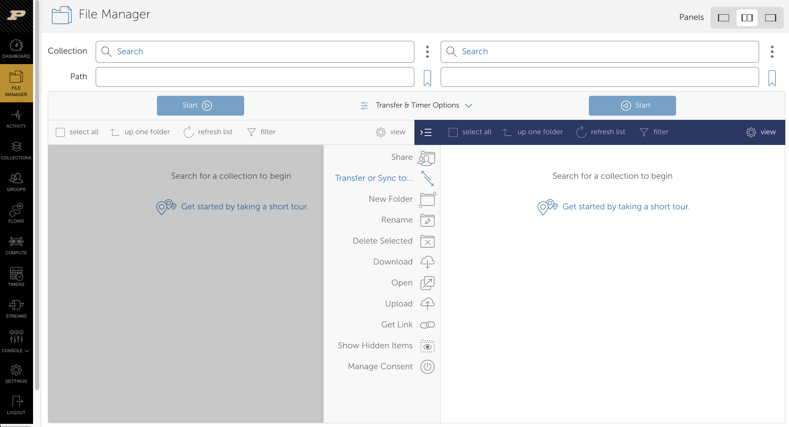
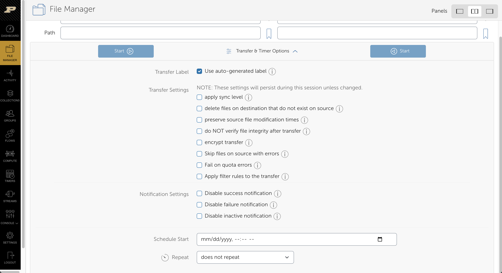
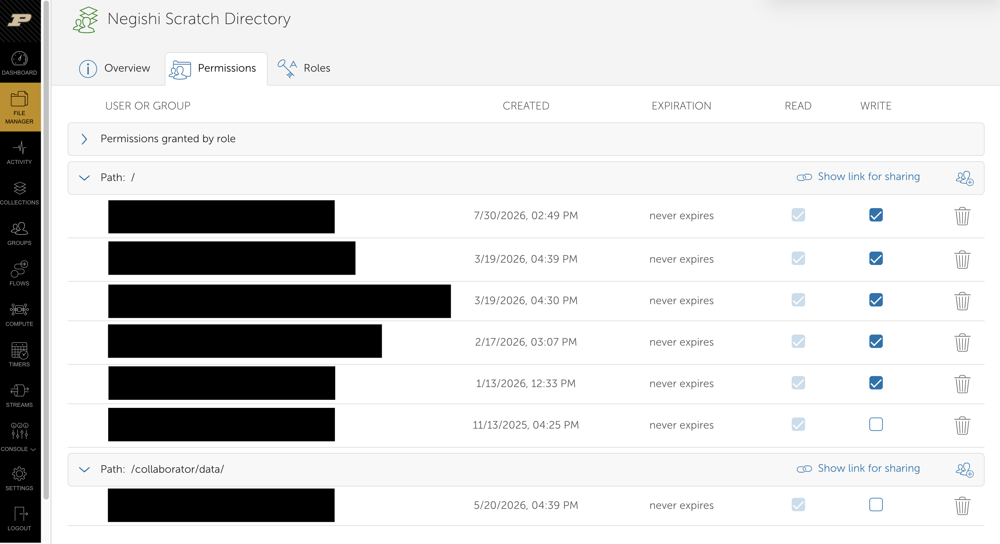

# Session 2: Data management for biologists (Fortress, Depot, Globus, DMP text) (Sep 29, 2026)

!!! info "Session details"
    - **Date:** Tuesday, September 29, 2026
    - **Time:** 11:00 AM – 12:00 PM EDT (10:00 – 11:00 AM CDT)
    - **Format:** 60 min interactive workshop, online (Microsoft Teams)
    - **Instructors:** Arun Seetharam and Rose Wilfong (RCAC)
    - **Register:** [Register for Session 2 on Microsoft Teams](https://events.teams.microsoft.com/event/f99c5474-7bdf-4987-9391-52e14578676b@4130bd39-7c53-419c-b1e5-8758d6d63f21). The Teams join link is sent to registrants.
    - **Recording:** [recording link coming soon]
    - **Materials:** This page.

This page is for Purdue faculty, postdocs, students, and staff in the life sciences who store or analyze research data on RCAC systems, whether or not you attended the session. It explains what each RCAC storage tier (home, scratch, Data Depot, Fortress) is for, how to share data within your lab and archive it to tape, how Globus moves data between tiers and to collaborators, and what to write in an NIH Data Management and Sharing (DMS) Plan. It ends with a five-step checklist to complete before your lab generates new data. No prior HPC experience is needed. An RCAC account and your lab's Data Depot group name help you run the commands.

## The data lifecycle on RCAC

RCAC has four storage tiers, each built for a different stage of a project. The most common mistake is leaving the only copy of important data in scratch.

A typical genomics project moves through the tiers like this:

1. Raw data arrives from the sequencing core. Put it on **Data Depot** and archive a copy to **Fortress** right away. For sequence data you will share, consider also submitting to NCBI (SRA or GEO) now with a release hold. NCBI keeps it private and releases it when the accession is published. Fortress remains your exact-copy backup; SRA does not return files byte-for-byte as submitted.
2. Copy the inputs your jobs need into **scratch** and run the analysis there.
3. Copy results worth keeping back to **Data Depot**.
4. When the project ends or the paper is published, bundle the project and archive it to **Fortress**.

**Home** holds your scripts, configuration files, and small documents, never sequencing data.

| | Home | Scratch | Data Depot | Fortress |
|---|---|---|---|---|
| **Purpose** | Scripts, configs, small files | Working space for running jobs | Shared, active lab data | Long-term archive (tape) |
| **Capacity** | 25 GB per user (TODO(arun): verify) | Large per-user quota; check with `myquota` | Purchased in 1 TB increments; 100 GB free trial | No quota |
| **Backup** | Nightly snapshots, kept up to about 3 months | None | Nightly snapshots, kept up to about 3 months; mirrored at two campus sites | Two copies on separate media; no protection against deletion |
| **Cost** | Included | Included | See the [RCAC orders page](https://www.rcac.purdue.edu/orders/products?category=3) (sign-in required) | Free with RCAC cluster access |
| **Purge** | Never | Files not accessed or modified in 60 days (30 days on Bell and Anvil) | Never | Never |
| **Who pays** | Included with your RCAC account | Included with your RCAC account | The lab (PI), annually | Included with RCAC services; storing more than 1 PB may incur a cost recovery charge |

!!! warning "Scratch purge"
    Scratch is not backed up, and RCAC no longer sends warning emails before a purge. Run `purgelist` on a cluster to see which of your scratch files are scheduled for removal.

Snapshots let you recover from accidental deletion for a limited time, but they are not a backup. A file deleted on the day it was created cannot be recovered. See [Data Depot lost file recovery](../../../../userguides/depot/recover/index.md).

## Depot and Fortress in practice

### Getting Data Depot for your lab

- The PI purchases capacity on the [Data Depot Purchase](https://www.rcac.purdue.edu/purchase) page, in 1 TB increments at an annual rate. You do not need to own cluster nodes.
- To try it first, [request a free 100 GB trial](https://www.rcac.purdue.edu/orders/products?category=3).
- Data on Depot belongs to the PI's research group, not to individuals, so it stays with the lab when students and postdocs leave.
- Each Depot group also gets a shared Fortress group space at `/group/mylab/`.

### Sharing and permissions

A lab's Depot space is `/depot/mylab/`, where `mylab` is your group name. By default it has a `data/` folder for shared research data and an `apps/` folder for shared software. Unix groups control access: for example, write access to `/depot/mylab/data/` requires membership in `mylab-data`. The PI or a designee manages membership on the [RCAC group management page](https://www.rcac.purdue.edu/account/groups). New members must log out and back in before their access takes effect.

Depot is suitable for non-HIPAA human subjects data. It is not approved for HIPAA, ePHI, FISMA, ITAR, or other regulated data.

### Fortress: hsi and htar

Fortress is a tape library. You cannot log in to it with SSH. From any RCAC cluster, use `hsi` to manage files and `htar` to create archives. No keytab setup is needed on RCAC systems.

Fortress stores a few large files efficiently but many small files very slowly. A file under about 30 to 50 MB counts as "small" at Fortress scale. Bundle directories of FASTQ files, per-sample outputs, or pipeline work folders into archives before sending them to Fortress. `htar` does this in one step, without needing local disk space for the archive.

### Commands

Replace `mylab` with your group name and `project_2026` with your project directory.

Check which lab storage groups you belong to:

```bash
groups
```

Count the files in a project directory before archiving (thousands of files means bundle them):

```bash
find /depot/mylab/data/project_2026 -type f | wc -l
```

Bundle a project directory into one archive in your lab's Fortress space, with checksum verification:

```bash
cd /depot/mylab/data
htar -Hverify=1 -cvf /group/mylab/project_2026.tar project_2026
```

List the contents of that archive without restoring it:

```bash
htar -tvf /group/mylab/project_2026.tar
```

List what is in your lab's Fortress space:

```bash
hsi ls -l /group/mylab
```

!!! note
    `htar` cannot archive a single file larger than 64 GB. Use `htar_large` for those files, or compress and `hsi put` them individually. Archiving a large project can take hours, so run it inside a batch job rather than on a login node.

!!! danger "Deletion on Fortress is permanent"
    Fortress keeps two copies of every file to protect against media failure, but if you delete or overwrite a file on Fortress, it cannot be recovered.

## Globus
Globus is a managed file-transfer service designed for moving large research datasets reliably and efficiently. It is especially useful for transfers that involve many files, hundreds of gigabytes or more, long transfer times, or data moving between institutions. Rather than keeping a terminal session or browser download running, you can submit the transfer to Globus and let the service manage it for you.

### Why use Globus for large transfers?

A long-running `scp` or `sftp` command can be interrupted by a dropped network connection, a closed laptop, or an expired terminal session. The user may then need to determine what arrived and restart or resume the transfer manually. Downloading to a laptop and uploading again is even less efficient when the real goal is to move data between two remote storage systems.

Globus uses a **fire-and-forget** model:

1. You select the source, destination, and files, then submit one transfer request.
2. Globus transfers the data directly between the two collections. Your browser is only the control interface and is not in the data path.
3. You may close the browser or sign out. Globus continues to monitor the task, tunes the transfer for performance, and retries recoverable network or system failures. When possible, it resumes from the point of failure rather than starting the entire transfer again.
4. Globus verifies file integrity with checksums and records the task in the **Activity** tab. It can email you when the transfer succeeds or when a problem needs your attention.

This makes Globus especially useful for transfers measured in hundreds of gigabytes or terabytes: users can start the work and return to their research instead of keeping a terminal open and watching the connection. “Fire-and-forget” does not mean “never check”. Users should confirm that the task reports **Succeeded** before deleting the source copy. Problems such as an expired login, insufficient destination space, or missing permissions still require user action; after the problem is corrected, Globus can continue the task.

### Globus endpoints at RCAC

In the Globus interface, a named location you can browse is called a **collection**. RCAC provides collections for most clusters and storage systems. Each collection is a doorway to a particular storage system; it does not create a new copy of the data.

To find a Purdue collection, select a collection search bar in File Manager and enter `Purdue` plus the cluster or storage-system name. Choose the collection carefully because some clusters expose home and scratch storage together, while others use separate collections.

#### Cluster home and scratch storage

For **Anvil**, **Negishi**, and **Gautschi**, home and scratch storage are available through one collection:

- **Home and scratch:** `Purdue {Name} Cluster`, replacing `{Name}` with the cluster name. For example, search for `Purdue Anvil Cluster`. After opening the collection, use the path field and directory browser to move between the home and scratch filesystems.

For **Bell** and **Gilbreth**, home and scratch storage use separate collections:

- **Home directories:** `Purdue {Name} Cluster - Home Directories`
- **Scratch directories:** `Purdue {Name} Cluster - Scratch`

For example, a Gilbreth user should select `Purdue Gilbreth Cluster - Home Directories` for files in home and `Purdue Gilbreth Cluster - Scratch` for files in scratch. If the expected files are not visible, first confirm that you opened the correct collection.

#### Group and archival storage

These collections are independent of the cluster collections:

- **Research Data Depot:** `Purdue Research Computing - Data Depot`. Search for `Purdue Data Depot`, then browse to your group's directory, such as `/depot/mylab/data/`.
- **Fortress:** `Purdue Fortress HPSS Archive`. Search for `Purdue Fortress`, then browse to your personal or group archive space, such as `/group/mylab/`.

Opening a collection does not grant additional access. Globus uses your RCAC identity and the underlying Unix permissions, so you will see only the directories and files your account is authorized to use. If a lab member cannot open a Depot group directory, verify their group membership rather than creating a new collection.

### Transferring to Depot and Fortress

1. Navigate to the [RCAC Globus transfer portal](https://transfer.rcac.purdue.edu/).
2. Sign in with your Purdue account. On your first visit, approve the prompts that connect your Purdue identity to Globus. If you have not recently authorized your credentials, you will be prompted to log in with MFA.
3. Open **File Manager** and switch to the two-panel view using the *Panels* options. Choose a collection for each panel. 


<div align="center">Above is an example of the two-panel view on the Globus webpage. Please note the <i>Panels</i> toggle in the upper right corner to select the two-panel view.</div>

After both collections are open, to transfer data from Data Depot to Fortress:

1. In one File Manager panel, select the collection search bar and search for "Purdue Data Depot". Select the `Purdue Research Computing - Data Depot` option. 
2. After the collection loads, navigate to `/depot/{mylab}/` to access your lab Data Depot space and browse to the files or directories you want to transfer.  
3. In the other panel, select the collection search bar and search for "Purdue Fortress". Select the `Purdue Fortress HPSS Archive` option. 
4. This option will open you in your home directory. To access your group's Fortress space, type `/group/{mylab}/` into the path bar and hit enter to navigate.
3. Select the items, choose the transfer direction, and start the transfer with the blue "Start" arrow on the source collection side. Globus copies the data; it does not remove the source.
4. Open the **Activity** tab to monitor the task. Wait for a **Succeeded** status before deleting or changing the source copy. If a task fails, open its details to see which files and errors were reported.

Alternatively, to transfer data from a cluster to Data Depot or Fortress, follow the above steps with your chosen cluster and storage destination.

#### Additional parameters for Globus transfers
Globus offers a series of parameters for the transfer in the **Transfer & Timer Options** drop-down menu between the two collections. Options include setting a label, applying a sync level, mirroring your directories, preserving source modification times, encrypting transfers, setting preferred notifications, and setting a recurring transfer (a Globus Timer).




### Sharing with external collaborators
Globus can give an external collaborator access to selected data without requiring a Purdue or RCAC account and without exposing the rest of your storage. It does this through a **guest collection**, a named share rooted at a folder you choose.

Within a guest collection, you can assign permissions to individual Globus users or groups. Permissions may apply to the guest collection's top-level folder or to particular subfolders, allowing one collaborator to have read-only access to one part of the collection while another has read-write access to a different part. Globus shares folders rather than individual files; to share only one file, place it in a dedicated folder.

1. Put the files in a dedicated folder so that the scope of the share is clear.
2. In File Manager, open the RCAC collection, select the folder, and choose **Share**.
3. Choose **Add Guest Collection**, give the collection a descriptive name, and create it.
4. Under **Permissions**, choose the folder or subfolder to share and add the collaborator by Globus identity or email address. Grant read access for downloads; add write access only if the collaborator must upload, replace, or delete files.
5. Send the collaborator the guest collection link. They sign in to Globus with their own institutional identity or a Globus ID and can transfer the data to a collection they can access. When creating the guest collection, there is also an option to send an email to your collaborator with a message.
6. Review and remove the permission when the collaboration ends.



<div align="center">Above is an example of the <i>Permissions</i> tab on a guest collection.</div>

!!! note "Permissions are additive"
    A narrower permission cannot take away access granted by a broader permission. For example, giving someone read-write access at the top level and read-only access to a subfolder does not make that subfolder read-only for that person. Start with the narrowest access needed and avoid overlapping permissions when possible.

Share the smallest practical folder, use read-only access by default, and never share credentials. Globus permissions add an access layer but do not replace the underlying filesystem permissions or make a storage system suitable for regulated data. Follow the project's approved data-handling plan before sharing human-subject or other restricted data. See the [Globus sharing guide](https://docs.globus.org/guides/tutorials/manage-files/share-files/) for the full procedure.

### Globus Connect Personal
Install [Globus Connect Personal](https://app.globus.org/file-manager/gcp) when one side of a transfer is your Windows, macOS, or Linux computer. It turns selected folders on that computer into a Globus collection.

1. Download and install Globus Connect Personal, sign in, and give the new collection a recognizable name such as `Rose's laptop`.
2. In its preferences, choose which local folders Globus may access. Do not expose your entire disk unless that access is necessary. Only select the "Shareable" option if you will need to create a guest collection on your device.
3. Keep Globus Connect Personal running and keep the computer awake and connected to the network during a transfer.
4. In the Globus File Manager, select your personal collection in one panel and an RCAC collection in the other, then start the transfer as usual.

Globus Connect Personal is useful for moving data between a computer and RCAC resources. For a transfer between Data Depot, Fortress, a cluster, or another institution's Globus collection, use those collections directly so your computer does not sit in the data path.

## DMP text

### What the NIH policy means for your lab

The [NIH Data Management and Sharing Policy](https://sharing.nih.gov/data-management-and-sharing-policy), effective January 25, 2023, requires a Data Management and Sharing Plan for NIH-funded research that generates scientific data. Three parts of it change what your lab does day to day:

- **Share in an established repository.** Use a domain repository where one exists (for example, SRA for reads, GEO for expression data, dbGaP for controlled-access human data). RCAC storage keeps your data safe but is not a public sharing repository.
- **Share on time.** Share data no later than the associated publication or the end of the award period, whichever comes first.
- **Submit early, release later.** Submitting raw reads to SRA or GEO at the start of a project, with a release hold, settles the repository and metadata up front. NCBI releases held data once the accession is published. TODO(arun): verify current maximum hold period and extension process. Do not use this route for human participant data; controlled-access data belongs in dbGaP.

### Getting help writing a DMP

!!! tip "Contact PURR for DMP help"
    For help writing a DMP, including templates and review, contact [PURR](https://purr.purdue.edu/). PURR is also a Purdue data repository that assigns DOIs, an option for data that has no domain repository such as SRA or GEO.

### RCAC storage text for your DMP or facilities statement

Paste this paragraph into your DMP template or facilities statement. Replace the bracketed fields and delete any sentence that does not apply to your project.

> Data will be stored on the Purdue Research Data Depot, operated by the Rosen Center for Advanced Computing (RCAC). Data Depot is enterprise-class GPFS storage mirrored across two campus data centers to protect against hardware failure and physical disaster, with nightly snapshots retained for up to three months to recover from accidental deletion. Access is restricted to members of the [LAB NAME] group, whose membership is authorized by the PI. Analyses will be performed on RCAC community clusters, which provide high-performance scratch storage for active computation. Raw data and final results will be archived on Fortress, RCAC's tape archive with a capacity of over 200 PB, which keeps two copies of every file on separate media. Data will be retained for [NUMBER] years after the end of the award, and data underlying publications will be deposited in [REPOSITORY, for example SRA or GEO] no later than the time of publication.

TODO(arun): verify this paragraph with RCAC before sharing it as approved text. For non-HIPAA human subjects data on Depot, RCAC provides [IRB-ready data security text](../../../../userguides/depot/faqs.md#what-do-i-need-to-do-in-order-to-store-non-hipaa-human-subjects-data-in-the-data-depot).

## Summary

**Before you generate data, do these 5 things:**

1. **Get Data Depot space for the lab** (purchase or trial) and agree on a folder layout.
2. **Set up access:** decide who needs read or write access and add them to the lab's Unix groups.
3. **Map each stage to a tier:** raw data on Depot, working files in scratch, results back on Depot, finished projects on Fortress.
4. **Archive raw data to Fortress on arrival**, bundled with `htar` and verified.
5. **Write the DMP now:** choose the sharing repository, the metadata standard, and the retention period. PURR can help.

**Feedback survey:** [Take the post-session survey](https://purdue.ca1.qualtrics.com/jfe/form/SV_5zozxPOpfZsjyui)

**Next session:** Tuesday, October 20, 2026, 11:00 AM EDT. [Nextflow fundamentals](../session3/index.md), with guest instructor Yucheng Zhang (Tufts University). [Register on Microsoft Teams](https://events.teams.microsoft.com/event/46244839-e339-4751-aa98-7ec633a06b1f@4130bd39-7c53-419c-b1e5-8758d6d63f21).

## Links

- [Data Depot overview](../../../../userguides/depot/overview.md)
- [Data Depot permissions and Unix groups](../../../../userguides/depot/permissions/unixgroups.md)
- [Data Depot file transfer, including Globus](../../../../userguides/depot/storage/transfer.md)
- [Fortress accounts and group space](../../../../userguides/fortress/accounts.md)
- [Fortress HSI](../../../../userguides/fortress/storage/transfer/hsi.md) and [HTAR](../../../../userguides/fortress/storage/transfer/htar.md)
- [Fortress with Globus](../../../../userguides/fortress/storage/transfer/globus.md)
- [Fortress limitations, including small files](../../../../userguides/fortress/faqs.md#what-limitations-does-fortress-have)

[Back to Fall 2026](../index.md)
